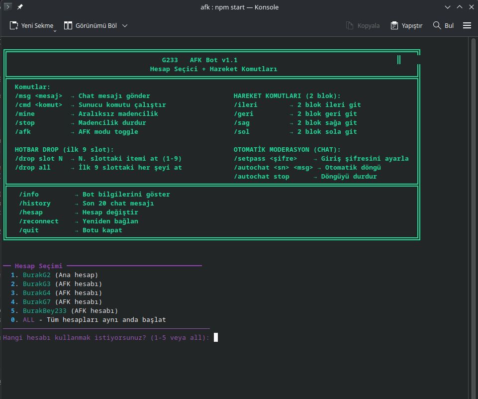
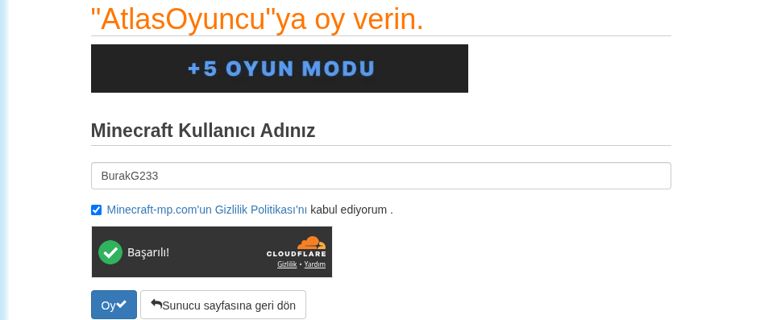

<div align="center">

# ⚡ Atlasoyuncu G233 Vote Bot

**Minecraft sunucunuza oy (vote) sitelerine otomatik oy veren akıllı terminal botu**

`G233 VOTİNG` tarafından • MIT Lisansı


</div>

---

## 🎯 Neden Atlasoyuncu G233 Vote Bot?

Ellerinizle her gün birden fazla oy sitesine girip oy vermek artık yok.
Bu bot sizin yerinize **otomatik olarak oy verir**, **Cloudflare engelini aşar**
ve isterseniz **reCAPTCHA'yı kendiliğinden çözer**. Günde bir kez çalışır,
biter, kapanır — siz sadece sunucuda oynamaya devam edin. 🎮

> Saatlerinizi oy vermekle harcamayın. Bot halletsin, siz oynayın.

---

## ✨ Özellikler

- 🗳️ **Birden fazla oy sitesine** tek oturumda otomatik oy verir
- 🛡️ **Cloudflare / reCAPTCHA / Turnstile** engellerini otomatik aşar
- 👤 Her sitenin **kullanıcı adı alanını** akıllıca doğrular:
  - alan boş ya da farklıysa doldurur, sonra oy verir
  - alan aynıysa olduğu gibi oy verir
- 📅 **Günlük oy takibi** (`config/vote_state.json`) — günde bir kez oy verir, çift oy önler
- ⏰ `--auto` modu ile **cron / systemd / Windows Görev Zamanlayıcı** entegrasyonu
- 🖥️ Şık, renkli **terminal menüsü** — site ekleme, düzenleme, ayarlar
- 🌐 Çoklu platform: **Windows, Ubuntu/Debian, Fedora**
- 🧩 3 farklı oy verme motoru: **SeleniumBase (UC) → nodriver → cloudscraper**

---

## 🚀 Hızlı Başlangıç

Platformunuza özel kurulum dosyaları `kurulum/` klasöründedir.

```bash
# 📦 Ubuntu / Debian
chmod +x kurulum/linux/install.sh && ./kurulum/linux/install.sh

# 🖥️ Fedora
chmod +x kurulum/fedora/install.sh && ./kurulum/fedora/install.sh

# 🪟 Windows: kurulum\windows\install.cmd dosyasına çift tıkla
```

Kurulum bittikten sonra botu `baslatma/` klasöründeki başlatıcılarla açın (çift tık):

```bash
# 🐧 Linux
chmod +x baslatma/linux/baslat.sh && ./baslatma/linux/baslat.sh

# 🪟 Windows
baslatma\windows\baslat.cmd   (çift tık)
```

> 📖 Detaylı kurulum rehberi: **KURULUM.md** · Kullanım kılavuzu: **KULLANIM_KILAVUZU.md**

---

## 🖼️ Ekran Görüntüleri

Botun oy verme sırasında aldığı örnekler (`config/screenshots/` klasöründe saklanır):

| | |
|---|---|
|  |  |

---

## 📁 Proje Yapısı

```
atlas_vote_bot_merged/
├── main.py                    ← 🤖 giriş noktası
├── atlas_vote_bot.py          ← 🔙 geriye dönük uyumluluk shim
├── baslatma/
│   ├── linux/                 ← 🐧 Linux başlatıcı (baslat.sh + masaüstü kısayolu)
│   └── windows/               ← 🪟 Windows başlatıcı (baslat.cmd)
├── kurulum/
│   ├── linux/                 ← 🐧 Ubuntu / Debian (install, systemd, cron)
│   ├── fedora/                ← 🖥️ Fedora (install, systemd, cron)
│   └── windows/               ← 🪟 Windows (install, zamanlayıcı)
├── config/
│   ├── bot_config.json        ← ⚙️ genel ayarlar
│   ├── vote_sites.json        ← 🌍 vote siteleri
│   └── vote_state.json        ← 📅 son oy tarihleri
├── modules/
│   ├── vote_engine.py         ← ⚙️ oy verme motoru (3 yöntem) + captcha çözücü
│   └── menu.py                ← 🖥️ terminal menüsü
├── utils/
│   └── logger.py              ← 📝 log sistemi
├── logs/                      ← 📊 log dosyaları
├── screenshots/               ← 📸 test ekran görüntüleri
├── KURULUM.md
├── KULLANIM_KILAVUZU.md
└── LICENSE
```

---

## 🔧 Oy Verme Motorları

Bot, hangisi kuruluysa onu otomatik seçer (sırasıyla):

| Motor | Tür | Açıklama |
|-------|-----|----------|
| **SeleniumBase UC Mode** | 🥇 birincil | Cloudflare çözümlü, gerçek tarayıcı |
| **nodriver** | 🥈 yedek | CDP tabanlı, asenkron, hızlı |
| **cloudscraper** | 🥉 son çare | HTTP tabanlı hafif çözüm |

```bash
pip3 install seleniumbase    # önerilen
# yedekler:
pip3 install nodriver cloudscraper
```

---

## ⏰ Otomatik Çalışma (Günde Bir Kez)

Bot `--auto` modu ile zamanlayıcıya bağlanır:

```bash
python3 main.py --auto        # 🐧 menü açmadan oy ver, kapat

# systemd (Linux) — her gün 09:00 + açılışta
sudo ./kurulum/linux/setup_systemd.sh

# cron (Linux) — her gün 09:00
./kurulum/linux/setup_cron.sh

# Windows Görev Zamanlayıcı
kurulum\windows\setup_windows_zamanlayici.cmd
```

---

## 🛡️ Lisans

MIT — bkz. **LICENSE**. Proje **G233 VOTİNG** markası altında dağıtılır.

> **Projeyi paylaşmadan önce** `config/vote_state.json`, `logs/` ve `screenshots/`
> verilerini temizleyin ve `config/bot_config.json` içindeki gizli
> `captcha_api_key` değerini boşaltın.

---

<div align="center">

**💙 İyi oylar, iyi oyunlar!**

</div>
